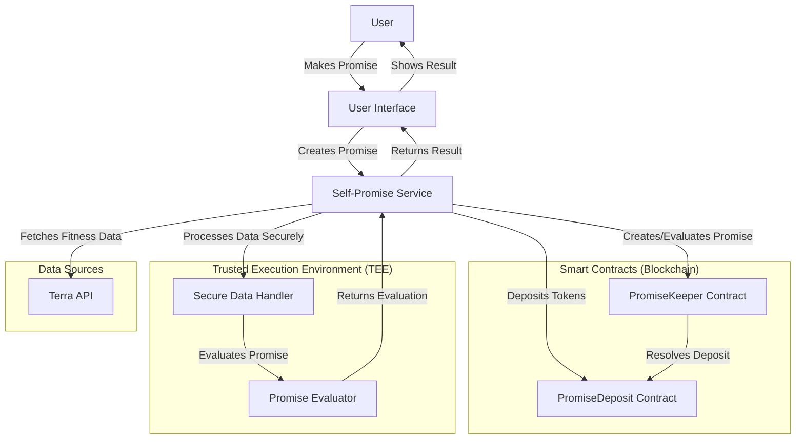
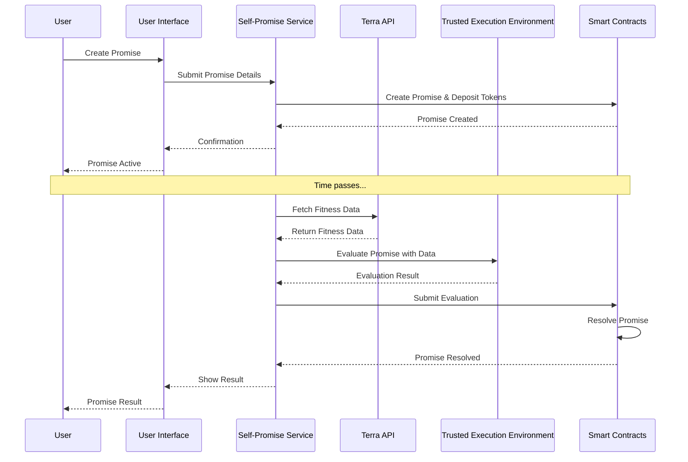

# Self-Promise Platform Architecture

## System Architecture



## Data Flow



## Component Relationships

```mermaid
classDiagram
    class SelfPromiseService {
        +create_promise()
        +evaluate_promise()
        +get_promise_status()
    }
    
    class TerraApiClient {
        +get_heart_rate_data()
        +get_exercise_sessions()
        +check_continuous_elevated_heart_rate()
    }
    
    class EvaluatorInterface {
        <<interface>>
        +evaluate()
    }
    
    class RuleBasedEvaluator {
        +evaluate()
    }
    
    class LLMEvaluator {
        +evaluate()
    }
    
    class SapphireClient {
        +deploy_contract()
        +call_contract()
        +send_transaction()
    }
    
    class SecureDataHandler {
        +encrypt_data()
        +decrypt_data()
        +secure_compute()
    }
    
    class PromiseDeposit {
        +deposit()
        +resolvePromise()
    }
    
    class PromiseKeeper {
        +createPromise()
        +evaluatePromise()
        +resolvePromise()
    }
    
    SelfPromiseService --> TerraApiClient: uses
    SelfPromiseService --> EvaluatorInterface: uses
    SelfPromiseService --> SapphireClient: uses
    SelfPromiseService --> SecureDataHandler: uses
    
    EvaluatorInterface <|-- RuleBasedEvaluator: implements
    EvaluatorInterface <|-- LLMEvaluator: implements
    
    SapphireClient --> PromiseDeposit: interacts with
    SapphireClient --> PromiseKeeper: interacts with
    
    PromiseKeeper --> PromiseDeposit: calls
