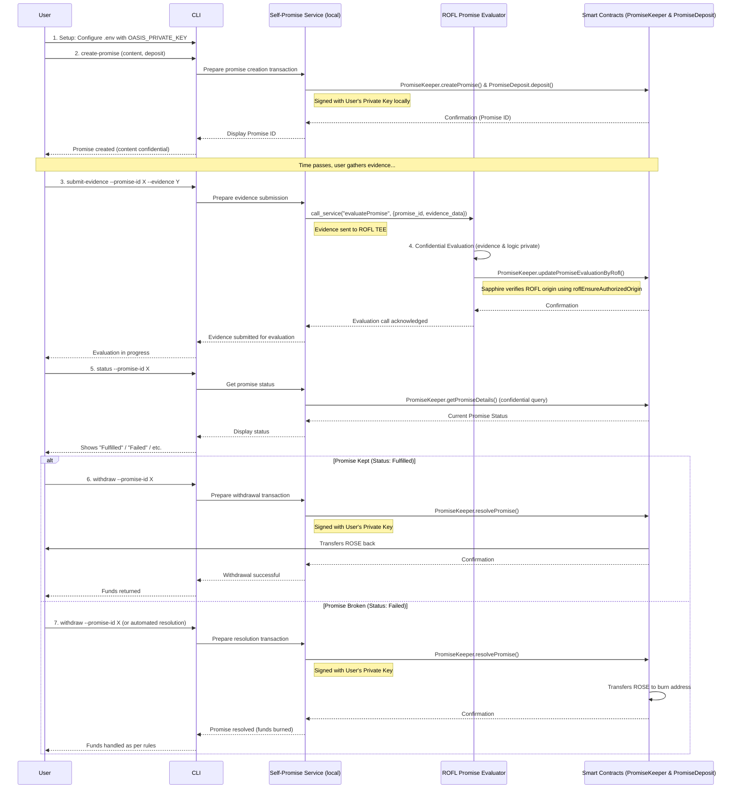
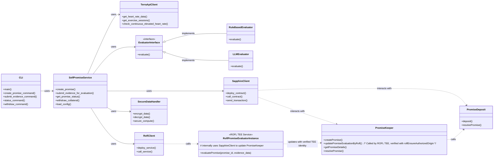

# Self-Promise Platform Architecture

## System Architecture

```mermaid
graph TD
    User[User] -->|Interacts via| CLI[CLI (Command Line Interface)]
    CLI -->|Invokes locally| Service[Self-Promise Service]
    
    subgraph "Oasis Sapphire TEE (Blockchain)"
        PromiseDeposit[PromiseDeposit Contract]
        PromiseKeeper[PromiseKeeper Contract]
    end
    
    Service -->|Signs & Sends Tx| PromiseDeposit
    Service -->|Signs & Sends Tx| PromiseKeeper
    PromiseKeeper -->|Resolves Deposit| PromiseDeposit
    
    subgraph "ROFL TEE (Off-Chain Confidential Compute)"
        RoflPromiseEvaluator[ROFL Promise Evaluator]
    end
    
    Service -->|Sends Promise ID, Evidence| RoflPromiseEvaluator
    RoflPromiseEvaluator -->|Calls updatePromiseEvaluationByRofl with TEE-verified identity| PromiseKeeper
    
    subgraph "Data Sources"
        FitnessGadget[User's Fitness Gadget Data]
    end
    
    User -->|Exports data| FitnessGadget
    FitnessGadget -->|Data supplied via CLI| Service
    
    RoflPromiseEvaluator -->|Returns result (via blockchain update)| Service
    Service -->|Reads status from blockchain| CLI
    CLI -->|Displays result| User
```

## Data Flow



## Component Relationships



## User Privacy & Security Flow

```mermaid
graph TD
    subgraph "User's Computer"
        CLI[CLI Tool]
        PrivateKey[Private Key in .env]
        PromiseData[Promise Content]
        EvidenceData[Evidence Data]
    end

    subgraph "Oasis Sapphire (Privacy Layer)"
        Encryption[Encrypt Transaction Data]
        TEEContracts[Contracts Execute in TEE]
    end

    subgraph "ROFL TEE (Confidential Compute)"
        SecureEvaluation[Evidence Evaluation]
        ROFLIdentity[ROFL TEE Identity]
    end

    subgraph "Blockchain State (Public)"
        WalletAddress[User's Wallet Address]
        PromiseExistence[Promise Existence]
        PromiseStatus[Promise Status]
    end

    CLI -->|Local signing| PrivateKey
    PrivateKey -->|Signs Tx| CLI
    CLI -->|Submit Promise| Encryption
    PromiseData -->|Input to Tx| Encryption
    
    Encryption -->|Encrypted Data| TEEContracts
    TEEContracts -->|Record Existence| PromiseExistence
    TEEContracts -->|Associate with| WalletAddress
    
    CLI -->|Submit Evidence| ROFL TEE
    EvidenceData -->|Input to| SecureEvaluation
    
    SecureEvaluation -->|Result| ROFLIdentity
    ROFLIdentity -->|Verified Update| TEEContracts
    TEEContracts -->|Update| PromiseStatus
    
    classDef private fill:#f9f,stroke:#333,stroke-width:2px;
    classDef encrypted fill:#bbf,stroke:#333,stroke-width:2px;
    classDef public fill:#bfb,stroke:#333,stroke-width:2px;
    
    class PrivateKey,PromiseData,EvidenceData private;
    class Encryption,TEEContracts,SecureEvaluation,ROFLIdentity encrypted;
    class WalletAddress,PromiseExistence,PromiseStatus public;
```

## Privacy & Security Features

1. **User Privacy**
   - User identity is only their public wallet address
   - Promise content and parameters are encrypted on-chain (Sapphire TEE)
   - Evidence data is processed only within ROFL TEE
   - Private key never leaves user's device

2. **Cryptographic Guarantees**
   - Transaction data to Sapphire is encrypted in transit and at rest
   - Smart contracts execute within Sapphire TEE
   - Evidence evaluation occurs within ROFL TEE
   - ROFL-to-Sapphire communication is cryptographically verified via `roflEnsureAuthorizedOrigin`

3. **Verified Evaluation Flow**
   - User evidence is sent to ROFL TEE
   - ROFL evaluates evidence confidentially
   - ROFL signs result with its TEE identity
   - Sapphire verifies ROFL identity before accepting updates
   - This ensures no one can spoof evaluation results
